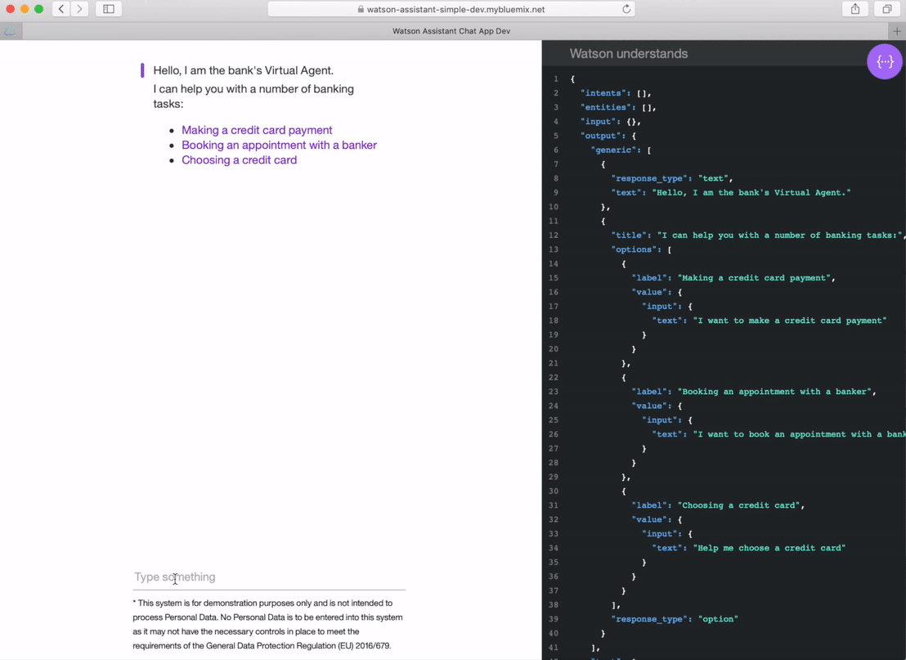

# Watson Assistant Quick Start

IBM Watson Assistant for IBM Cloud Pak for Data combines machine learning, natural language understanding, and an integrated dialog editor to create conversation flows between your apps and your users.  

This Node.js app demonstrates the Watson Assistant service in a simple interface engaging in a series of simple simulated banking tasks.



You can view a [demo](http://conversation-simple.ng.bluemix.net/) of this app.

## Getting started

### Installing the Watson Assistant add-on on IBM Cloud Pak for Data 

Make your data ready for an AI and multicloud world. Cloud Pak for Data System is an all-in-one cloud-native Data and AI platform in a box, providing a pre-configured, governed, and secure environment to collect, organize and analyze data. [Learn more](https://docs-icpdata.mybluemix.net/docs/content/SSQNUZ_current/com.ibm.icpdata.doc/zen/overview/overview.html).

Install Cloud Pak for Data on OpenShift- [Instructions](https://docs-icpdata.mybluemix.net/docs/content/SSQNUZ_current/com.ibm.icpdata.doc/zen/install/ovu.html)

Install the Watson Assistant add-on - [instructions](https://docs-icpdata.mybluemix.net/docs/content/SSQNUZ_current/com.ibm.icpdata.doc/watson/assistant-install.html)

### Creating a project

After logging in with `oc login`, if you don't have a project setup all ready, go ahead and take care of that:

        $ oc new-project my-project --display-name="My Project"

That's it, project has been created. It would probably be good to set your current project, such as:

        $ oc project my-project

### Creating the apps from a template

Create the app from the watson-assistant-nodejs-sample-template.json template by using the -f flag and pointing the tool at a path to the template file:

        $ oc new-app -f https://raw.githubusercontent.com/avigadmi/watson-assistant-example/master/watson-assistant-nodejs-sample-template.json

add required parameters: 
X
Y
Z

#### Configuring a workspace

The following steps are to optionally retrieve a workspace id and configure it for your application. If you do not configure a workspace id, the first workspace will be used, or a new workspace will be created.

1. Click on your Watson Assistance instance.

1. From the **Manage** page, click **Launch tool**.

1. Click the dots in the upper right hand corner for the workspace you want and click **View details**.

1. Copy the `Workspace ID` and paste this as a quickstart parameter labeled `WORKSPACE_ID`.


#### Build the app

`oc new-app` will kick off a build once all required dependencies are confirmed.

Check the status of your new nodejs app with the command:

        $ oc status
        
If the build is not yet started (you can check by running `oc get builds`), start one and stream the logs with:

        $ oc start-build nodejs-ex --follow
        
#### Deploy the app

Deployment happens automatically once the new application image is available.  To monitor its status either watch the web console or execute `oc get pods` to see when the pod is up.  Another helpful command is

        $ oc get svc
        
        
This will help indicate what IP address the service is running, the default port for it to deploy at is 8080. Output should look like:

        NAME        CLUSTER-IP       EXTERNAL-IP   PORT(S)    SELECTOR                                AGE
        nodejs-ex   172.30.249.251   <none>        8080/TCP   deploymentconfig=nodejs-ex,name=myapp   17m                


#### Configure routing

An OpenShift route exposes a service at a host name, like www.example.com, so that external clients can reach it by name.

DNS resolution for a host name is handled separately from routing; you may wish to configure a cloud domain that will always correctly resolve to the OpenShift router, or if using an unrelated host name you may need to modify its DNS records independently to resolve to the router.

That aside, let's explore our new web console, which for our example is running at [https://10.2.2.2:8443](https://10.2.2.2:8443).

After logging into the web console with your same CLI `oc login` credentials, click on the project we just created, then click `Create route`.

If you're running OpenShift on a local machine, you can preview the new app by setting the Hostname to a localhost like: *10.2.2.2*.

This could also be accomplished by running:

        $ oc expose svc/nodejs-ex --hostname=www.example.com

Now navigate to the newly created Node.js web app at the hostname we just configured, for our example it was simply [https://10.2.2.2](https://10.2.2.2).

#### Success

You should now have a Node.js welcome page showing the current hit count, as stored in a MongoDB database.

#### Pushing updates

Assuming you used the URL of your own forked repository, we can easily push changes and simply repeat the steps above which will trigger the newly built image to be deployed.


### Web UI

To run this example from the Web UI, you can same steps following done on the CLI as defined above.

### Running locally

The following steps are for running locally with Node.js.

1. To develop locally, first install [Node.js](https://nodejs.org) ([LTS](https://github.com/nodejs/Release) supported versions).

2. In the application folder, copy the *.env.example* file and create a file called *.env*
       
    ```sh
    cp .env.example .env
    ```       

7. Open the *.env* file and add `ASSISTANT_IAM_APIKEY`, `ASSISTANT_URL` and the optionally `WORKSPACE_ID`.
    
3. Install the dependencies:

    ```sh
    npm install
    ```

4. Start the app:

    ```sh
    npm start
    ```

5. Point your browser to [localhost:3000](http://localhost:3000).


### Known issues

Please note this app uses the Watson Assistant for IBM Cloud Pak for Data v1 API. If you need more information, you can go to the [Watson Assistant V1 API page](https://cloud.ibm.com/apidocs/assistant-data-v1).  
The [Watson Assistant for IBM Cloud Pak for Data v2 API](https://cloud.ibm.com/apidocs/assistant-data-v2) doesn't yet support creation of assistants.

### Testing the app

After your app is installed and running, experiment with it to see how it responds.

The chat interface is on the left, and the JSON that the JavaScript code receives from the Watson Assistant service is on the right. Your questions and commands are interpreted using a small set of sample data trained with the banking intents:

* Visit the documentation to learn more about [intents](https://cloud.ibm.com/docs/services/assistant/intents.html#defining-intents) and [entities](https://cloud.ibm.com/docs/services/assistant/entities.html#defining-entities)

## License

  This sample code is licensed under Apache 2.0.
